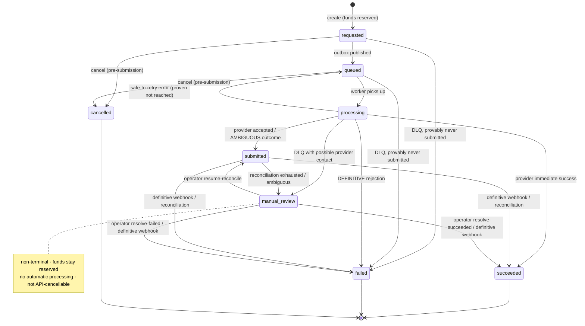
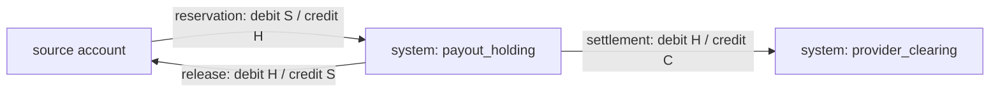

# ledger-payout-service

A from-scratch **double-entry ledger and payout service**, built as an engineering
demonstration. It moves **no real money**, integrates with **no real payment provider** (a
local mock stands in), and has **no end-user authentication** — it is designed to run
locally or on a trusted network. Everything here is **locally implemented and tested**: it
is not deployed and not production-proven.

- **Language / stack:** TypeScript (strict), Fastify, PostgreSQL (Kysely), Redis + BullMQ.
- **What's interesting:** the money-safety properties — idempotency, a transactional
  outbox, a payout state machine with reserved funds, signed webhooks with replay
  protection, and a deliberate *never auto-release on an ambiguous outcome* rule.
- **Scale of evidence:** 192 automated tests (unit + integration against real PostgreSQL
  and Redis + failure-injection + concurrency); 21 ADRs; a threat model and a runbook.

Milestones: M1 skeleton · M2 ledger · M3 payouts/outbox/worker/webhooks/reconciliation ·
M3.1 ambiguous-payout safety · **M4 public-readiness (this one): OpenAPI, `/metrics`,
threat model, container hardening, CI security scans, local benchmark.**

---

## 1. What it demonstrates

- **Correctness under concurrency** for money: a double-entry ledger where every
  transaction balances and no committed account balance goes negative, proven by
  concurrency tests, not just asserted.
- **Idempotency** done properly — required keys, payload-hash conflict detection,
  in-progress handling, survives restarts, PostgreSQL-backed (not Redis).
- **Reliable asynchronous work** — a transactional outbox, an at-least-once queue with
  idempotent consumers, retry/backoff, dead-lettering, and reconciliation.
- **Handling the hard case honestly** — when a payment provider's outcome is *ambiguous*
  (timeout, 5xx, unknown status, missing webhook), the money is neither paid twice nor
  clawed back on a guess; the payout parks in `manual_review` with funds reserved until a
  human resolves it.
- **Operability** — health/readiness, an opt-in Prometheus endpoint with identifier-free
  labels, structured logs, a threat model, and an incident runbook.
- **Public-readiness engineering** — OpenAPI with a drift test, a hardened non-root
  container, supply-chain scanning, fail-closed production config.

## 2. Why financial workflows are hard

A payout leaves your system and depends on a third party you don't control. The failure
modes that matter are the *uncertain* ones:

- The provider call **times out** — did the payment go through or not?
- The provider returns **500** — "definitely not processed", or "processed, but our ack
  failed"?
- The **success webhook never arrives** — lost, or never sent?
- A retry **re-submits** — did you just pay the beneficiary twice?
- A webhook says `failed` **after** you already settled — who wins?

Guessing wrong in either direction is a real loss: release the reservation *and* the
provider pays → double-spend; settle on a false positive → the beneficiary is short. This
project's core design decision is to **only release reserved funds automatically after a
definitive provider rejection or a pre-submission cancellation** — everything else is held
and escalated.

## 3. Core guarantees

| Guarantee | How it's enforced |
|---|---|
| Every ledger transaction has ≥ 2 entries and debits = credits | deferred constraint trigger at `COMMIT` + service checks ([ADR 0010](docs/adr/0010-double-entry-invariant-enforcement.md)) |
| No committed balance goes negative on a non-overdraft account | `BIGINT` balance projection + `CHECK` + row-locked writes ([ADR 0007](docs/adr/0007-balance-projection-vs-derived-balance.md), [ADR 0008](docs/adr/0008-transaction-and-locking-strategy.md)) |
| Money is exact | integer minor units end to end — `BIGINT` / `bigint` / digit strings in JSON, no float ([ADR 0006](docs/adr/0006-money-as-integer-minor-units.md)) |
| A retried write happens once | `Idempotency-Key` + `(scope, key)` unique + payload hash ([ADR 0009](docs/adr/0009-postgresql-backed-idempotency.md)) |
| A payout reservation settles **or** releases, at most once, never both | mutually-exclusive `CHECK` constraints on the payout row ([ADR 0011](docs/adr/0011-payout-reservation-accounting.md)) |
| Outbox events are delivered at least once; consumers absorb duplicates | `jobId = outbox event id`, `INSERT ... ON CONFLICT DO NOTHING` ([ADR 0013](docs/adr/0013-transactional-outbox.md)) |
| An ambiguous provider outcome never auto-releases funds | outcome taxonomy defaults to `ambiguous`; `manual_review` state ([ADR 0018](docs/adr/0018-ambiguous-outcomes-and-manual-review.md)) |

Delivery semantics, stated precisely: **at-least-once delivery + idempotent accounting
effects + at-most-once settlement/release per payout.** Not exactly-once.

## 4. Architecture

A **modular monolith**, four processes over one codebase and one database:

```
 API (src/index.ts) ──── HTTP ──────────────────────────┐
     │ writes payout + outbox event in ONE transaction   │
     ▼                                                    ▼
 PostgreSQL ◀── publisher (src/publisher.ts) polls outbox_events ──► Redis / BullMQ
     ▲                                                                     │
     │                                                          worker (src/worker.ts)
     │                                                                     │ calls
     │                          mock-provider (src/mock-provider/) ◀───────┘
     │                                    │ signed webhook
     └────────────────────────────────────┴──► API  POST /v1/webhooks/provider/payouts

 reconcile (src/reconcile.ts) — one pass; you run it on a schedule
 payout-admin (src/payout-admin.ts) — local operator CLI for the manual_review queue
```



Layering: HTTP routes validate and map errors only; application services own the use case
and the transaction boundary; repositories are thin Kysely data access taking a transaction
handle; domain modules (`money`, `payout-state`, `webhook-signature`, …) are pure and
unit-tested in isolation; services are built once in `composition.ts` and injected
([ADR 0004](docs/adr/0004-modular-monolith.md)).

## 5. Transfer flow

`POST /v1/transfers` with an `Idempotency-Key`, in one transaction: lock the source account
row, check funds, write a balanced `transfer` ledger transaction (debit source / credit
destination), update both balance projections, store the idempotency record. Same key +
same body replays the stored response; same key + different body is `409`; a validation or
transient error stores nothing.

## 6. Payout lifecycle & accounting

Create reserves funds; a confirmed success settles; a failure or pre-submission cancel
releases. Every movement is a balanced ledger transaction.



Total value across `source + holding + clearing` is conserved by construction. The state
machine (see §4) is the single source of truth — routes, worker, webhook, reconciliation
and the operator CLI all go through one `assertTransition`
([ADR 0012](docs/adr/0012-payout-state-machine.md)).

## 7. Ambiguous-outcome safety

`classifyTransportError` **defaults to `ambiguous`** — an unrecognised error is never
guessed in our favour. A conservative `ProviderCapabilities` contract is the only place a
real adapter opts into stronger guarantees.

| Bucket | Examples | Action |
|---|---|---|
| definitive success | signed success webhook; status query says paid | settle (once) |
| definitive failure | explicit 4xx; signed failure webhook; status says failed | release (once) |
| safe-to-retry | connection refused / DNS failure *before* send | retry same idempotency key; release only if provably never submitted |
| **ambiguous** | timeout, reset, 5xx, unparseable body, unknown status, missing webhook, exhausted budget with possible contact | **never release** → `submitted` → reconcile → `manual_review` |

A webhook/status that **contradicts** an already-applied terminal effect is logged, metered
(`payout_outcome_conflicts_total`), acknowledged (`conflict_ignored`), and produces no
second effect. Terminal wins; a human investigates
([ADR 0018](docs/adr/0018-ambiguous-outcomes-and-manual-review.md)).

`manual_review` payouts are resolved with the local CLI — there is **no HTTP admin
endpoint** (no authn/authz in this milestone):

```bash
npm run payout-admin -- inspect <payoutId>
npm run payout-admin -- resolve-succeeded <payoutId> --reason "…" --operator "ops-jane" --confirm
npm run payout-admin -- resolve-failed    <payoutId> --reason "…" --operator "ops-jane" --confirm
npm run payout-admin -- resume-reconcile  <payoutId> --reason "…" --operator "ops-jane"
```

Every resolution — including a rejected contradictory one — writes an immutable
`payout_resolutions` audit row (no credentials, no personal data).

## 8. Transactional outbox

The `outbox_event` is written **in the same transaction** as the payout reservation. The
`publisher` polls due `pending` events (`FOR UPDATE SKIP LOCKED`), enqueues each with
`jobId = outbox event id`, and marks it published — one transaction. Die mid-way and the
row stays `pending` and is re-enqueued; BullMQ dedupes the job id. `OUTBOX_ENQUEUE_TIMEOUT_MS`
bounds each `queue.add` and a session-level idle timeout frees the row lock if Redis hangs
([ADR 0013](docs/adr/0013-transactional-outbox.md), [ADR 0014](docs/adr/0014-bullmq-at-least-once.md)).

## 9. Tech stack

| Area | Choice | ADR |
|---|---|---|
| Language | TypeScript, `strict`, ESM, Node 20 | — |
| HTTP | Fastify 5 + Zod validation | [0002](docs/adr/0002-fastify-as-http-framework.md) |
| Database | PostgreSQL 16, Kysely query builder + migrator | [0003](docs/adr/0003-kysely-for-database-access.md) |
| Queue | Redis + BullMQ (separate worker process) | [0014](docs/adr/0014-bullmq-at-least-once.md) |
| Logging | pino (structured, redacting) | — |
| Tests | vitest + Testcontainers (real PostgreSQL + Redis) | — |
| Structure | modular monolith | [0004](docs/adr/0004-modular-monolith.md) |

## 10. Quick start

Requires Node 20.19–20.x and Docker.

```bash
npm ci
cp .env.example .env          # placeholders only
docker compose up -d          # PostgreSQL + Redis
npm run migrate:up

# each in its own terminal (for a full end-to-end demo set ALLOW_FUNDING=true + WEBHOOK_SECRET in .env)
npm run dev                   # API              http://127.0.0.1:3000
npm run dev:publisher         # outbox → queue
npm run dev:worker            # queue → provider
npm run dev:mock-provider     # the fake provider http://127.0.0.1:4000
npm run reconcile             # one reconciliation pass (repeat on your own schedule)
```

Fund an account, pay out, watch it settle:

```bash
ACCT=$(curl -sX POST localhost:3000/v1/accounts -H 'content-type: application/json' \
  -d '{"externalId":"seller-1","currency":"USD"}' | jq -r .account.id)
curl -sX POST localhost:3000/v1/accounts/$ACCT/funding -H 'content-type: application/json' \
  -H 'idempotency-key: fund-1' -d '{"amount":"500000","currency":"USD"}'
PAYOUT=$(curl -sX POST localhost:3000/v1/payouts -H 'content-type: application/json' \
  -H 'idempotency-key: payout-1' \
  -d "{\"sourceAccountId\":\"$ACCT\",\"amount\":\"120000\",\"currency\":\"USD\"}" | jq -r .payout.id)
curl -s localhost:3000/v1/payouts/$PAYOUT | jq .payout.status
```

## 11. API

Full spec: [`openapi/openapi.yaml`](openapi/openapi.yaml) (OpenAPI 3.1; generated JSON at
[`openapi/openapi.json`](openapi/openapi.json)). `npm run openapi:check` fails the build if
the spec drifts from the routes the app registers.

```
POST /v1/accounts · GET /v1/accounts/:id · GET /v1/accounts/:id/ledger-entries
POST /v1/accounts/:id/funding                (dev/demo only — 403 unless ALLOW_FUNDING=true)
POST /v1/transfers · GET /v1/transfers/:id · GET /v1/ledger-transactions/:id
POST /v1/payouts · GET /v1/payouts/:id · GET /v1/payouts?status=&limit=&cursor=
POST /v1/payouts/:id/cancel                  (only requested/queued, no provider contact)
POST /v1/webhooks/provider/payouts           (HMAC-signed)
GET  /healthz · GET /readyz · GET /metrics    (/metrics only when METRICS_ENABLED=true)
```

Consistent error envelope: `{ "error": { "code", "message", "details"? }, "requestId" }`;
every response echoes `x-request-id` and carries `x-content-type-options`, `x-frame-options`
and `referrer-policy`. Manual-review resolution is **not** an HTTP endpoint.

## 12. Running processes

| Process | Command | Role |
|---|---|---|
| API | `npm run dev` / `node dist/index.js` | HTTP surface; writes payout + outbox atomically |
| publisher | `npm run dev:publisher` | relays `outbox_events` → BullMQ |
| worker | `npm run dev:worker` | consumes jobs, calls the provider, applies outcomes |
| reconcile | `npm run reconcile` | one pass over stale non-terminal payouts |
| mock-provider | `npm run dev:mock-provider` | **local only**; simulates the provider + signed webhooks |
| payout-admin | `npm run payout-admin -- …` | **local only**; resolve `manual_review` payouts |

One `Dockerfile` builds an image that runs any of these via a command override
([ADR 0021](docs/adr/0021-runtime-hardening-and-fail-closed.md)).

## 13. Tests & concurrency evidence

```bash
npm run test:unit     # fast, no Docker
npm test              # unit + integration + failure-injection + concurrency (one PG + one Redis container)
npm run check         # format · lint · typecheck · openapi:check · docs:links · test · build · compose · scan
```

192 tests. The concurrency tests are the load-bearing ones:

- **150 transfers fired in parallel** from one source account whose balance covers 100 of
  them: exactly 100 commit `201`, 50 are rejected `insufficient_funds`, **no committed
  account balance became negative**, and the summed ledger value is unchanged.
- **150 payouts created in parallel** on one source account: reservation capacity is
  respected, no balance goes negative, total value across source + holding + clearing is
  conserved.
- **Many payouts driven to an ambiguous provider outcome in parallel** all land in
  `manual_review` with funds reserved — none lost, none double-applied.
- **Cancellation vs worker submission race** — exactly one side wins, never both.
- Failure injection at seven points (after payout insert, after reservation, after outbox
  insert, after provider accept, …) verifies each partial failure leaves a recoverable
  state.

## 14. Security & threat model

- **Signed webhooks** — HMAC-SHA256 over the raw body, timestamp window, constant-time
  compare, fail-closed (`503`) with no secret; DB-backed replay protection.
- **Fail-closed production config** — refuses to start in `NODE_ENV=production` without
  `WEBHOOK_SECRET`, with `ALLOW_FUNDING=true`, or with a placeholder DB password.
- **Secret hygiene** — `.env` gitignored; structural + local-term proprietary/secret
  scanner; gitleaks over full history in CI; `.dockerignore` keeps secrets / `.git` / tests
  out of the image.
- **Supply chain** — `npm ci` from a committed lockfile; production `npm audit` is a hard
  CI gate (currently **0**); CycloneDX SBOM per build; license gate; Trivy (fs/config/image)
  and CodeQL configured.
- **Container** — multi-stage, pinned Node base, non-root (`uid 1000`), no dev deps, no
  shell in `CMD`, healthcheck; compatible with `--read-only --cap-drop ALL`.

Full analysis with residual risk per threat: [`docs/THREAT_MODEL.md`](docs/THREAT_MODEL.md)
(STRIDE + abuse cases). Policy: [`SECURITY.md`](SECURITY.md). Operations:
[`docs/RUNBOOK.md`](docs/RUNBOOK.md).

## 15. Observability

- **Structured logs** (pino) on the payout path: payout id, outbox event id, job id,
  provider correlation id, attempt number, `from`→`to` transition, outcome category,
  duration, idempotency replay/conflict, webhook verification outcome. Credentials, full
  bodies, beneficiary detail, signatures and stack traces are never logged.
- **`GET /metrics`** — opt-in via `METRICS_ENABLED` (default off → 404). Prometheus text
  from the in-process registry: HTTP request count + duration histogram, transfers/payouts
  by outcome, provider attempts, **ambiguous outcomes, manual-review backlog / age, outbox
  pending / dead / oldest, `outbox_dead_with_reserved_payout`, worker DLQ, webhook accepted
  / rejected / replayed / conflict, reconciliation outcomes,
  `payouts_reserved_beyond_threshold`**. Every label is a bounded enum, an HTTP method, a
  status class, or a normalised route template — **never** an id, key, reference or error
  string ([ADR 0020](docs/adr/0020-metrics-endpoint.md)).
- A **local** throughput/latency smoke test (`npm run bench`) — see
  [`docs/PERFORMANCE.md`](docs/PERFORMANCE.md). `LOCAL_BENCHMARK_ONLY`; not a capacity claim.

## 16. Known limitations

- **No authentication / authorization** on the API, and no authenticated admin service —
  the operator CLI has direct DB access with an unverified `operator_reference`. This is
  the single biggest "do not deploy as-is".
- No real provider adapter, no external credentials — only the local mock.
- No rate limiting, multi-tenancy, currency conversion, fees, or refunds.
- `reconcile` and the `publisher` loop have no built-in scheduler; you run them.
- Payouts over one hot source account (or the shared per-currency holding account)
  serialise on that row — a per-account throughput ceiling, by design.
- Committed ledger transactions are immutable; corrections would be new reversing
  transactions (not built).
- Kysely table types are hand-maintained; currencies are `char(3)` format-checked, not
  ISO-4217-validated; payouts are limited to the seeded currencies (`USD`, `IDR`, `EUR`,
  `SGD`).
- GitHub Actions are pinned to version tags, not commit SHAs — a tracked pre-public item
  ([`docs/PUBLIC_RELEASE_CHECKLIST.md`](docs/PUBLIC_RELEASE_CHECKLIST.md)).
- `npm audit` reports 5 moderate **dev-only** advisories (one root cause: `uuid` via
  `testcontainers`); **0** in the production dependency tree —
  [`docs/DEPENDENCY_LICENSE_REVIEW.md`](docs/DEPENDENCY_LICENSE_REVIEW.md).

## 17. Roadmap

| Milestone | Content | Status |
|---|---|---|
| M1 | Skeleton: TS strict, env schema, Docker Compose, health/readiness, CI, ADRs | done |
| M2 | Accounts, double-entry ledger, idempotent transfers, concurrency invariant test | done |
| M3 | Payout state machine + reservation accounting, transactional outbox + publisher, BullMQ worker, mock provider, signed webhooks + replay protection, reconciliation | done |
| M3.1 | Ambiguous-outcome safety: `manual_review`, "never auto-release on ambiguous", provider capability contract, operator CLI + audit | done |
| **M4** | Public-readiness: OpenAPI + drift test, `/metrics`, threat model, runbook, container hardening, CI security/supply-chain scans, local benchmark | **done (local)** |
| M5 | Authentication + an authenticated admin service (prerequisite for any real deployment); a real provider adapter | planned |
| M6 | Deploy to one managed host with a public demo URL | planned |

## 18. License

[MIT](LICENSE). This project is **generic and independent** — it does not reproduce the
schema, table names, transaction formats, retry policies, provider integrations or internal
architecture of any system the author has worked on professionally. A `scan:proprietary`
gate blocks proprietary identifiers; generic engineering vocabulary is allowed.
