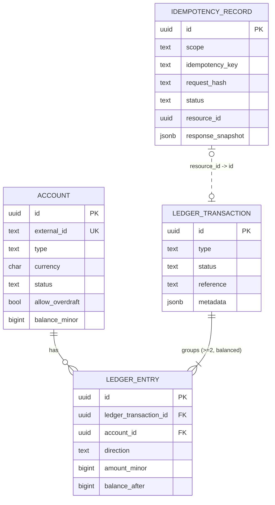
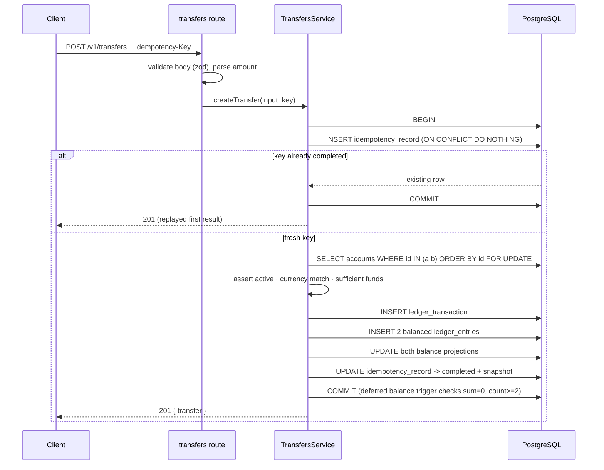

# ledger-payout-service

A generic, from-scratch **double-entry ledger and payout service**. It is an engineering
demonstration — **not** a real financial service, and it moves **no real money**.

> **Milestone: M2 — Accounts, double-entry ledger & idempotent transfers.**
> Implemented and tested locally (unit + integration + a real concurrency test). Payouts,
> outbox, worker, webhooks, and auth are **not** built yet — see [Roadmap](#roadmap).

---

## What M2 does

- Create accounts; read an account with its balance; read an account's ledger history
  (deterministic, keyset-paginated).
- Give an account an opening balance through a **balanced ledger transaction** (dev/test
  funding endpoint) — never by writing a balance directly.
- Move value between two internal accounts with a **double-entry transfer** that is atomic,
  concurrency-safe, and **idempotent** via an `Idempotency-Key`.
- Enforce the accounting invariant (≥ 2 entries, debits = credits) in the database.

## Architecture overview

A **modular monolith** in TypeScript (Fastify HTTP, PostgreSQL via Kysely). No worker, no
Redis on the ledger path in M2.

```
src/
  config/        env schema (zod)
  domain/        money, errors, fingerprint, transfer rules   (pure, no I/O)
  infra/         db pool, transaction+retry helper, metrics, logger
  http/          error envelope, keyset cursor, header parsing
  db/            kysely table types, migrations (static), migrate CLI
  modules/
    accounts/    routes · service · repository · schemas
    transfers/   routes · service   (uses ledger + idempotency)
    ledger/      repository only (append-only postings)
    idempotency/ repository · service (the gate)
    health/      liveness / readiness
```

Layering: HTTP routes validate and map errors only; application services own the use case
and the transaction boundary; repositories are thin Kysely data access that accept a
transaction handle; domain modules are pure and unit-tested in isolation. Dependencies are
passed in (`new AccountsService(db)`), not imported as singletons.

## Money representation

Integer **minor units** everywhere: PostgreSQL `BIGINT`, JS `bigint` (the `pg` driver is
configured to parse `int8` as `bigint`), and **strings of digits in API JSON** (`"1500"`).
No floating point in the value path. See
[ADR 0006](docs/adr/0006-money-as-integer-minor-units.md).

## Double-entry model

| Concept | Notes |
|---|---|
| **ledger_transaction** | `funding` or `transfer`; groups the entries; immutable once committed (M2). |
| **ledger_entry** | `direction` (`debit`/`credit`) + **positive** `amount_minor` + `balance_after`. |
| **account** | internal `id` (uuid), stable `external_id`, `type` (`user`/`system`), one `currency`, `status` (`active`/`frozen`/`closed`), `allow_overdraft`, projected `balance_minor`. |
| **idempotency_record** | unique `(scope, idempotency_key)`, `request_hash`, `status`, `resource_id`, response snapshot. |

**Sign convention:** a `credit` increases an account's balance, a `debit` decreases it.
Per transaction, `Σ credits == Σ debits` and there are at least two entries — enforced by a
deferred constraint trigger at `COMMIT`
([ADR 0010](docs/adr/0010-double-entry-invariant-enforcement.md)) as well as by the service.

**Balance** is a cached projection (`accounts.balance_minor`) updated in the *same*
transaction as its entries; `balance_after` on each entry is the audit trail and a
cross-check ([ADR 0007](docs/adr/0007-balance-projection-vs-derived-balance.md)).



## Transfer flow

One database transaction (READ COMMITTED), retried on a transient failure.



## Idempotency behaviour

`Idempotency-Key` is **required** on `POST /v1/transfers` (and accepted on funding).

| Situation | Result |
|---|---|
| New key, valid request | transfer happens once, `201` |
| Same key, same payload | first transfer's result replayed, no new entries |
| Same key, different payload | `409 idempotency_conflict` |
| Two parallel requests, same key | one transfer; the other blocks then replays |
| Request fails validation | nothing stored; the key is still usable |
| Transient DB failure | transaction rolls back; nothing stored |
| Process restart | guarantee holds (records only commit as `completed`) |

Fingerprint = `sha256(scope + canonicalJson(semantic fields))`.
See [ADR 0009](docs/adr/0009-postgresql-backed-idempotency.md).

## Concurrency strategy

READ COMMITTED + `SELECT ... FOR UPDATE` on both accounts in **ascending-id order**
(deterministic → no deadlock) + bounded retry on `40001`/`40P01`. No in-memory locking; no
single-instance assumption. Full rationale and trade-offs in
[ADR 0008](docs/adr/0008-transaction-and-locking-strategy.md).

## API (v1)

All responses share an error envelope:
`{ "error": { "code", "message", "details"? }, "requestId" }`.
Every response echoes `x-request-id`.

```
POST /v1/accounts                     { externalId, currency, allowOverdraft? } -> 201 { account }
GET  /v1/accounts/:id                 -> 200 { account }   (includes balanceMinor)
GET  /v1/accounts/:id/ledger-entries  ?limit=&cursor=      -> 200 { entries, nextCursor }
POST /v1/accounts/:id/funding         Idempotency-Key; { amount, currency, reference? } -> 201 { ledgerTransaction }
POST /v1/transfers                    Idempotency-Key; { sourceAccountId, destinationAccountId, amount, currency, reference?, metadata? } -> 201 { transfer }
GET  /v1/transfers/:id                -> 200 { transfer }
GET  /v1/ledger-transactions/:id      -> 200 { ledgerTransaction }
```

Example — create, fund, transfer:

```bash
# create two accounts
curl -sX POST localhost:3000/v1/accounts -H 'content-type: application/json' \
  -d '{"externalId":"alice","currency":"USD"}'
curl -sX POST localhost:3000/v1/accounts -H 'content-type: application/json' \
  -d '{"externalId":"bob","currency":"USD"}'

# give alice an opening balance (dev/test only)
curl -sX POST localhost:3000/v1/accounts/<ALICE_ID>/funding \
  -H 'content-type: application/json' -H 'idempotency-key: fund-alice-1' \
  -d '{"amount":"100000","currency":"USD"}'

# transfer 250.00 alice -> bob
curl -sX POST localhost:3000/v1/transfers \
  -H 'content-type: application/json' -H 'idempotency-key: xfer-1' \
  -d '{"sourceAccountId":"<ALICE_ID>","destinationAccountId":"<BOB_ID>","amount":"25000","currency":"USD"}'
```

Error codes: `validation_error` (400), `idempotency_key_required` (400), `same_account`
(400), `account_not_found` (404), `not_found` (404), `account_not_active` (409),
`currency_mismatch` (409), `idempotency_conflict` (409), `request_in_progress` (409),
`funding_disabled` (403), `insufficient_funds` (422), `unsupported_currency` (422),
`internal_error` (500, no internal detail leaked).

## Local setup

Requirements: Node.js 20.11+ and Docker (Postgres; and for the integration tests, which use
Testcontainers).

```bash
npm install
cp .env.example .env               # placeholder values are fine for local dev

docker compose up -d               # Postgres (+ Redis, unused in M2) on 127.0.0.1
npm run migrate:up                 # apply migrations to a fresh database
npm run dev                        # http://127.0.0.1:3000
```

### Migrations

```bash
npm run migrate:up        # migrate to latest
npm run migrate:down      # roll back the most recent migration (dev)
npm run migrate:status    # list migrations and whether they have run
```

Migrations are static TypeScript modules (`src/db/migrations/`), run by Kysely's `Migrator`
in filename order — identical under `tsx` and the compiled build. Validated: a fresh
database migrates from zero; re-running `up` is a no-op; `down` then `up` round-trips; the
test schema is produced by the same migrations as production.

### Running tests

```bash
npm run test:unit          # fast; no Docker
npm test                   # unit + integration + concurrency (starts one PG container)
npm run test:concurrency   # just the 100+ parallel-transfer invariant test
```

### Quality gates

```bash
npm run check   # format:check · lint · typecheck · test · build · compose:config · scan:proprietary
```

## Observability

Structured (pino) logs on the transfer path include: request id, transfer / ledger
transaction id, operation, outcome (`committed` / `idempotent_replay` / `rejected`),
duration, and error category. Credentials, full request bodies, and raw stack traces are
never logged or returned to clients. In-process counters (`src/infra/metrics.ts`):
transfers, failed transfers, funding, idempotency replays / conflicts, transfer retries. No
metrics endpoint yet (M5).

## Known limitations (M2)

- Transfers over a single hot account serialise on that row (throughput ceiling per
  account).
- Funding exists and is enabled by default for demo convenience; it must be disabled
  (`ALLOW_FUNDING=false`) in any real deployment.
- Kysely table types are hand-maintained alongside migrations (no generation step).
- `char(3)` currency codes are format-checked, not validated against ISO 4217; funding is
  limited to the seeded system-account currencies (`USD`, `IDR`, `EUR`, `SGD`).
- No auth, rate limiting, or per-tenant isolation.
- Committed ledger transactions are immutable — there is no reversal/correction flow yet.

## Not in M2 (built later)

Payout state machine · external provider (mock) · transactional outbox · queue worker ·
webhooks (signature, retry, dead-letter) · reconciliation job · end-user auth ·
multi-currency conversion / fees / refunds · Prometheus endpoint · deployment · website.

## Roadmap

| Milestone | Content |
|---|---|
| M1 (done) | Skeleton: TS strict, lint/format, env schema, Docker Compose, health/readiness, CI file, ADRs |
| **M2 (done)** | Accounts, double-entry ledger, idempotent transfers, concurrency invariant test, migrations |
| M3 | Payout state machine, transactional outbox, worker + mock provider |
| M4 | Signed webhooks, idempotent apply, retry/backoff, dead-letter |
| M5 | Reconciliation job, Prometheus metrics, runbook |
| M6 | Threat model, CI security scans, OpenAPI |
| M7 | Deploy to one managed host, public demo URL |

## Security disclaimer

A **demo**. No real money, no real user data, no real provider. No secrets are committed —
`.env` is gitignored; only `.env.example` (placeholders) is tracked. This project is
**generic and independent**: it does not reproduce the schema, table names, transaction
formats, retry policies, provider integrations, or internal architecture of any system the
author has worked on professionally. A `scan:proprietary` gate enforces this.

## License

[MIT](LICENSE)
