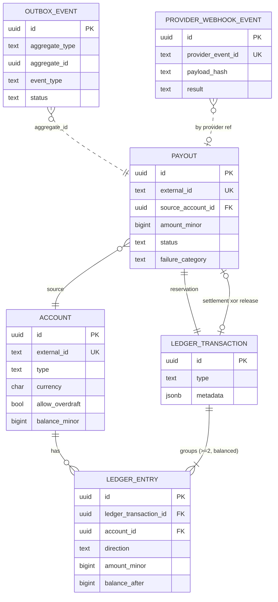
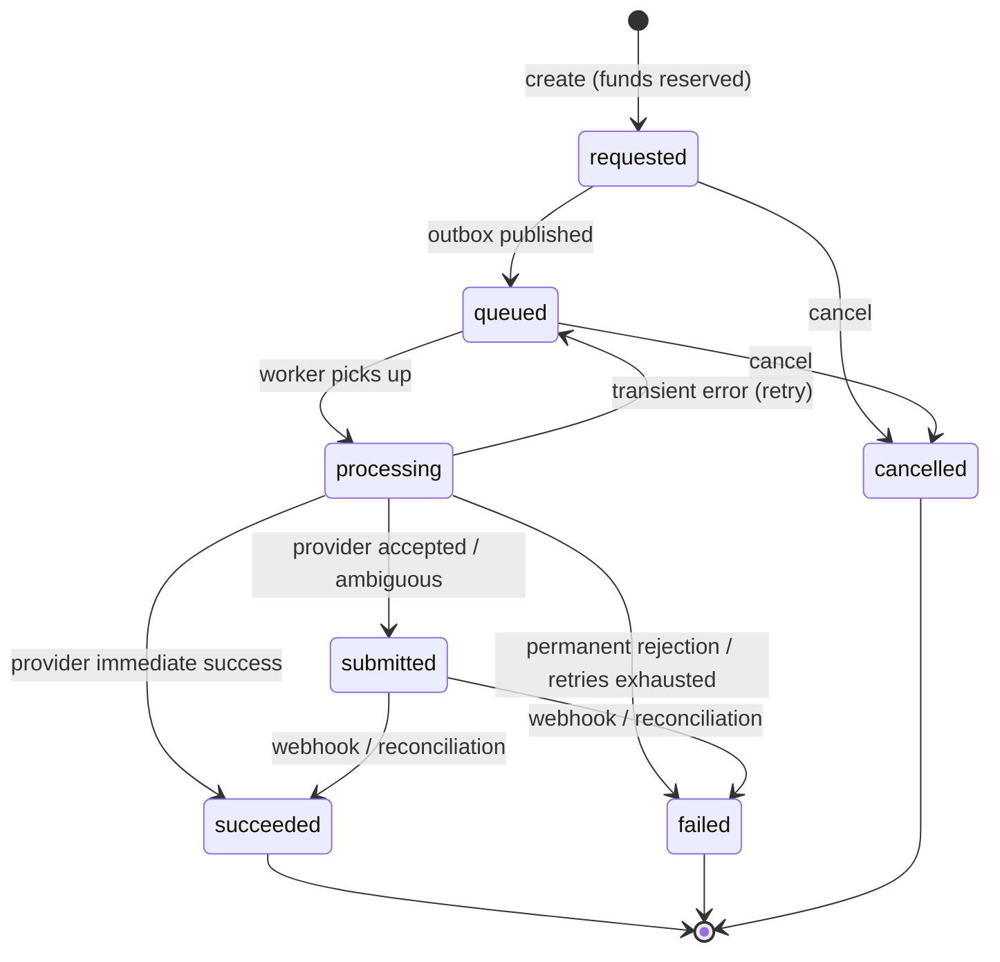
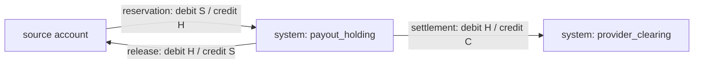

# ledger-payout-service

A generic, from-scratch **double-entry ledger and payout service**. It is an engineering
demonstration — **not** a real financial service, and it moves **no real money**.

> **Milestone: M3 — Payouts, transactional outbox, worker, signed webhooks & reconciliation.**
> Implemented locally; unit-, integration-, failure-injection- and concurrency-tested
> against real PostgreSQL and Redis. No real provider, no auth, no deployment — see
> [Roadmap](#roadmap).

---

## What the service does

**M2 — ledger core**

- Accounts with a projected balance; deterministic, keyset-paginated ledger history.
- Double-entry **transfers** between internal accounts: atomic, concurrency-safe,
  idempotent via `Idempotency-Key`.
- The accounting invariant (≥ 2 entries, debits = credits) enforced in the database.
- A dev/demo **funding** endpoint (disabled by default) that injects an opening balance
  through a balanced ledger transaction — never a direct balance write.

**M3 — payouts**

- **Payouts** to an external provider (a local **mock** in M3) with a **state machine** and
  **reserved funds**: create reserves `source → holding`; a confirmed success settles
  `holding → provider clearing`; a failure or cancel releases `holding → source`. Every
  movement is a balanced ledger transaction.
- A **transactional outbox** + a **publisher** process: the payout job is written in the
  same DB transaction as the reservation and relayed to the queue at least once.
- A **BullMQ worker** process that calls the provider (idempotently), classifies the
  outcome (transient / permanent / ambiguous), retries with backoff, and dead-letters.
- **Signed inbound webhooks** (`HMAC-SHA256` over the raw body, timestamp window,
  constant-time compare) with PostgreSQL-backed replay protection and exactly-once apply.
- A **reconciliation** pass that resolves stale payouts by asking the provider directly —
  and never releases funds on a timeout alone.

## Architecture overview

A **modular monolith** in TypeScript (Fastify HTTP, PostgreSQL via Kysely, Redis/BullMQ for
the payout queue). Four processes, one codebase, one database:

```
 API (src/index.ts) ─── HTTP ───────────────┐
                                            │  writes payout + outbox event (1 txn)
 publisher (src/publisher.ts) ── polls outbox_events ──► BullMQ ──► worker (src/worker.ts)
                                                                       │ calls
 mock-provider (src/mock-provider/) ◄───────────────────────────────────┘
        │ signed webhook
        └────────────► API  POST /v1/webhooks/provider/payouts

 reconcile (src/reconcile.ts) ── one pass, run on a schedule you control
```

```
src/
  config/        env schema (zod)
  domain/        money, errors, fingerprint, transfer rules,
                 payout-state, provider-outcome, webhook-signature   (pure, no I/O)
  infra/         db pool, tx+retry, metrics, logger, queue, lifecycle, fault (test-only)
  http/          error envelope, keyset cursor, header parsing
  db/            kysely table types, migrations (static), migrate CLI
  composition.ts the composition root (buildServices)
  modules/
    accounts/    routes · service · repository · schemas
    transfers/   routes · service
    ledger/      repository + postBalancedTransfer helper
    idempotency/ repository · service (the gate)
    payouts/     routes · service · repository · schemas · state transitions
                 · worker · reconciliation
    outbox/      repository · publisher
    provider/    port · mock HTTP client
    webhooks/    routes · service · repository · schemas
    health/      liveness / readiness
  mock-provider/ a separate local-only Fastify app that simulates the provider
```

Layering: HTTP routes validate and map errors only; application services own the use case
and the transaction boundary; repositories are thin Kysely data access that accept a
transaction handle; domain modules are pure and unit-tested in isolation; services are
built once in `composition.ts` and passed in, never imported as singletons. ADR 0004.

## Money representation

Integer **minor units** everywhere: PostgreSQL `BIGINT`, JS `bigint` (the `pg` driver
parses `int8` as `bigint`), **digit strings in API JSON** (`"1500"`). No floating point in
the value path. [ADR 0006](docs/adr/0006-money-as-integer-minor-units.md).

## Double-entry model

| Concept | Notes |
|---|---|
| **ledger_transaction** | `funding` \| `transfer` \| `payout_reservation` \| `payout_settlement` \| `payout_release`; groups the entries; immutable once committed. |
| **ledger_entry** | `direction` (`debit`/`credit`) + **positive** `amount_minor` + `balance_after`. |
| **account** | internal `id`, stable `external_id`, `type` (`user`/`system`), one `currency`, `status`, `allow_overdraft`, projected `balance_minor`. System accounts: `system:funding:<CUR>`, `system:payout_holding:<CUR>`, `system:provider_clearing:<CUR>`. |
| **payout** | `external_id` (= provider idempotency key), `source_account_id`, `amount_minor`, `status`, the reservation / settlement / release ledger-transaction ids, `failure_category`, attempt counters. |
| **outbox_event** | `aggregate_type`/`aggregate_id`, `event_type`, `payload`, `status` (`pending`/`published`/`dead`), `attempt_count`, `available_at`. |
| **provider_webhook_event** | unique `provider_event_id`, `payload_hash`, `result`. |
| **idempotency_record** | unique `(scope, idempotency_key)`, `request_hash`, response snapshot. |

**Sign convention:** a `credit` increases an account's balance, a `debit` decreases it. Per
transaction, `Σ credits == Σ debits` and there are ≥ 2 entries — enforced by a deferred
constraint trigger at `COMMIT`
([ADR 0010](docs/adr/0010-double-entry-invariant-enforcement.md)) and by the services.
**Balance** is a cached projection updated in the same transaction as its entries
([ADR 0007](docs/adr/0007-balance-projection-vs-derived-balance.md)).



## Payout lifecycle



Full transition matrix and the transient/permanent/ambiguous taxonomy:
[ADR 0012](docs/adr/0012-payout-state-machine.md).

## Payout flow (create → provider → outcome)

```mermaid
sequenceDiagram
    participant C as Client
    participant API as API
    participant DB as PostgreSQL
    participant P as publisher
    participant Q as BullMQ
    participant W as worker
    participant PR as provider (mock)

    C->>API: POST /v1/payouts + Idempotency-Key
    API->>DB: BEGIN
    API->>DB: reserve: debit source, credit holding (balanced txn)
    API->>DB: INSERT payout (status=requested)
    API->>DB: INSERT outbox_event (payout.requested)
    API->>DB: INSERT idempotency_record
    API->>DB: COMMIT
    API-->>C: 201 { payout: requested }

    loop poll
        P->>DB: claim pending outbox_events FOR UPDATE SKIP LOCKED
        P->>Q: add(job, {payoutId}, jobId = event.id)
        P->>DB: mark published + payout requested->queued (same txn)
    end

    Q->>W: job
    W->>DB: payout queued->processing
    W->>PR: createPayout(idempotencyKey = external_id)
    alt immediate success
        PR-->>W: succeeded
        W->>DB: settle: debit holding, credit clearing; payout->succeeded
    else accepted (async)
        PR-->>W: accepted
        W->>DB: payout->submitted
        PR-->>API: signed webhook payout.succeeded / payout.failed
        API->>DB: settle / release (idempotent); record webhook receipt
    else permanent rejection
        PR-->>W: 4xx
        W->>DB: release: debit holding, credit source; payout->failed
    else transient / ambiguous
        W->>DB: transient -> queued (BullMQ retries); ambiguous -> submitted
        Note over W,DB: reconciliation resolves anything left in submitted
    end
```

## Accounting movement



Total value across `source + holding + clearing` is conserved by construction — every
transaction balances. [ADR 0011](docs/adr/0011-payout-reservation-accounting.md).

## Transactional outbox & delivery semantics

An `outbox_event` is written **in the same transaction** as the payout reservation. The
`publisher` process polls due `pending` events (`FOR UPDATE SKIP LOCKED`), enqueues each to
BullMQ with **`jobId = outbox event id`**, and marks it published — all in one transaction.
If the process dies between the enqueue and the commit, the row stays `pending` and is
re-enqueued next cycle; BullMQ ignores the duplicate job id. **Delivery is at least once;
every consumer is idempotent.** [ADR 0013](docs/adr/0013-transactional-outbox.md),
[ADR 0014](docs/adr/0014-bullmq-at-least-once.md).

## Worker: retry, classification, dead-letter

- **Transient** (connection refused, 429, 5xx): re-throw → BullMQ retries with exponential
  backoff + jitter, up to `WORKER_MAX_ATTEMPTS`.
- **Permanent** (4xx rejection): release funds, `failed`, no retry.
- **Ambiguous** (timeout / reset after send): move to `submitted`, **no release** —
  reconciliation owns it.
- **Dead-letter** (retries exhausted): release **only if** the payout never reached
  `submitted`; otherwise leave it for reconciliation.
- Provider idempotency key = the payout's `external_id`, sent on every attempt, so a retry
  never creates a second provider-side payout.
  [ADR 0015](docs/adr/0015-provider-idempotency.md).

## Signed webhooks & replay protection

`POST /v1/webhooks/provider/payouts`. Headers: `x-provider-timestamp`,
`x-provider-signature: sha256=<hex>`, `x-provider-event-id`. The signature is
`hex(HMAC-SHA256(secret, timestamp + "." + rawBody))`. Verification uses the raw bytes, a
constant-time compare, and `WEBHOOK_TOLERANCE_SEC`. No `WEBHOOK_SECRET` → `503` (fail
closed). Bad signature / stale timestamp → `401`.

Application is one transaction: `INSERT ... ON CONFLICT DO NOTHING` on `provider_event_id`
→ a seen id with the same payload hash replays the first result (`200`), a different hash
is `409`; a new event applies the settle/release transition (idempotent, terminal-wins) and
records the result. Concurrent duplicates block on the unique id and replay.
[ADR 0016](docs/adr/0016-webhook-signing-and-replay-protection.md).

## Reconciliation

`npm run reconcile` runs one pass. It selects non-terminal payouts stale for longer than
`RECONCILE_STALE_AFTER_SEC`, asks the provider `getPayoutStatus`, and: succeeded → settle;
failed → release; pending → reschedule (funds stay reserved); unknown → reschedule until
`RECONCILE_MAX_ATTEMPTS`, then release as `reconciliation_not_found`. **A timeout never
releases funds** — only a definite provider answer does.
[ADR 0017](docs/adr/0017-reconciliation-policy.md). M3 ships no scheduler; run it on a
loop / systemd timer / cron of your own.

## Idempotency behaviour

`Idempotency-Key` is **required** on `POST /v1/transfers` and `POST /v1/payouts` (and
accepted on funding). New key → once. Same key + same payload → replay the first result.
Same key + different payload → `409`. Parallel same-key → one operation; the others block
then replay. Validation failure or transient DB error → nothing stored. Survives process
restart (records only ever commit as `completed`). PostgreSQL-backed, not Redis.
[ADR 0009](docs/adr/0009-postgresql-backed-idempotency.md).

## Concurrency strategy

READ COMMITTED. Deterministic lock order: **payout row first (`FOR UPDATE`), then accounts
in ascending-id order**, so no two flows deadlock. Bounded retry on serialization failure /
deadlock (`40001` / `40P01`). Outbox and reconciliation claims use `FOR UPDATE SKIP
LOCKED`. No in-memory locking; no single-instance assumption.
[ADR 0008](docs/adr/0008-transaction-and-locking-strategy.md).

## API (v1)

Consistent error envelope `{ "error": { "code", "message", "details"? }, "requestId" }`;
every response echoes `x-request-id`.

```
# accounts / ledger (M2)
POST /v1/accounts                        { externalId, currency, allowOverdraft? } -> 201 { account }
GET  /v1/accounts/:id                    -> 200 { account }
GET  /v1/accounts/:id/ledger-entries     ?limit=&cursor= -> 200 { entries, nextCursor }
POST /v1/accounts/:id/funding            Idempotency-Key; { amount, currency, reference? } (dev/demo only)
POST /v1/transfers                       Idempotency-Key; { sourceAccountId, destinationAccountId, amount, currency, reference?, metadata? }
GET  /v1/transfers/:id
GET  /v1/ledger-transactions/:id

# payouts (M3)
POST /v1/payouts                         Idempotency-Key; { sourceAccountId, amount, currency, externalId?, reference?, metadata? } -> 201 { payout }
GET  /v1/payouts/:id                     -> 200 { payout }
GET  /v1/payouts?status=&limit=&cursor=  -> 200 { payouts, nextCursor }
POST /v1/payouts/:id/cancel              -> 200 { payout }   (only while requested/queued)

# webhooks (M3)
POST /v1/webhooks/provider/payouts       signed; -> 200 { received, result, replay }
```

Example — fund, pay out, watch it settle:

```bash
ACCT=$(curl -sX POST localhost:3000/v1/accounts -H 'content-type: application/json' \
  -d '{"externalId":"seller-1","currency":"USD"}' | jq -r .account.id)

# dev/demo funding (needs ALLOW_FUNDING=true)
curl -sX POST localhost:3000/v1/accounts/$ACCT/funding \
  -H 'content-type: application/json' -H 'idempotency-key: fund-1' \
  -d '{"amount":"500000","currency":"USD"}'

PAYOUT=$(curl -sX POST localhost:3000/v1/payouts \
  -H 'content-type: application/json' -H 'idempotency-key: payout-1' \
  -d "{\"sourceAccountId\":\"$ACCT\",\"amount\":\"120000\",\"currency\":\"USD\"}" | jq -r .payout.id)

# with the publisher + worker + mock-provider running, it reaches "succeeded"
curl -s localhost:3000/v1/payouts/$PAYOUT | jq .payout.status
```

Payout error codes add: `payout_not_found` (404), `payout_not_cancellable` (409),
`invalid_payout_transition` (409), `webhook_not_configured` (503),
`webhook_signature_invalid` / `webhook_timestamp_invalid` (401), `webhook_conflict` (409).

## Local setup (multi-process)

Requirements: Node.js 20.19+ and Docker (PostgreSQL + Redis; also for the integration
tests, which use Testcontainers).

```bash
npm install
cp .env.example .env
# for a local end-to-end demo, uncomment ALLOW_FUNDING=true and set WEBHOOK_SECRET in .env

docker compose up -d          # PostgreSQL + Redis
npm run migrate:up

# each in its own terminal:
npm run dev                   # API            http://127.0.0.1:3000
npm run dev:publisher         # outbox -> queue
npm run dev:worker            # queue -> provider
npm run dev:mock-provider     # the fake provider   http://127.0.0.1:4000
npm run reconcile             # one reconciliation pass (repeat on your own schedule)
```

### Migrations

```bash
npm run migrate:up        # to latest
npm run migrate:down      # roll back the most recent migration (dev)
npm run migrate:status
```

Static TypeScript modules (`src/db/migrations/`), run by Kysely's `Migrator` in filename
order — identical under `tsx` and the compiled build. Validated: fresh DB from zero
(M1→M2→M3); an existing M2 DB upgrades to M3; re-running `up` is a no-op; full `down`→`up`
round-trips; the test schema is produced by the same migrations as production.

### Running tests

```bash
npm run test:unit          # fast; no Docker
npm test                   # unit + integration + failure-injection + concurrency
                           # (one PostgreSQL + one Redis container for the whole run)
npm run test:concurrency   # just the parallel-transfer + parallel-payout invariant tests
```

### Quality gates

```bash
npm run check   # format:check · lint · typecheck · test · build · compose:config · scan:proprietary
```

## Observability

Structured (pino) logs on the payout path include: payout id, outbox event id, job id,
provider correlation id, attempt number, transition (`from`→`to`), outcome category,
duration, idempotency replay/conflict, webhook verification outcome (no signature detail),
reconciliation outcome. Credentials, full request bodies, beneficiary detail, signatures,
and raw stack traces are never logged or returned.

In-process counters/gauges (`src/infra/metrics.ts`, `metrics.snapshot()`): payouts created
& by state, payout transitions, settlements/releases, provider attempts & error classes,
outbox published / retried / pending / oldest-age / dead, worker jobs / retries / DLQ,
webhook accepted / rejected / replayed, reconciliation runs & outcomes. Naming follows
Prometheus conventions; there is no `/metrics` endpoint yet (M5).

## Known limitations (M3)

- Payouts over one hot source (or the shared per-currency holding account) serialise on
  that row — a throughput ceiling per account, as with M2 transfers.
- No real provider adapter, no external credentials — only the local mock.
- `reconcile` and the `publisher` loop have no built-in scheduler; you run them.
- The publisher holds the outbox row lock across the `queue.add` call; a very slow Redis
  slows the relay (it never corrupts it).
- `unknown`-after-`RECONCILE_MAX_ATTEMPTS` releases funds — an explicit, bounded policy
  (ADR 0017); worth alerting on in a real system.
- Kysely table types are hand-maintained. `char(3)` currencies are format-checked, not
  ISO-4217-validated; payouts are limited to the seeded currencies (`USD`, `IDR`, `EUR`,
  `SGD`).
- No auth, rate limiting, multi-tenancy, or multi-currency conversion / fees / refunds.
- Committed ledger transactions are immutable — corrections would be new reversing
  transactions (not built).
- Dev-only `npm audit` reports one moderate advisory in the `testcontainers → dockerode →
  uuid` chain; no production-dependency vulnerabilities. See the M3 report.

## Not in M3

Real payout provider · external credentials · multi-tenancy · end-user authentication ·
multi-currency conversion · fee engine · a `/metrics` endpoint · Grafana / tracing ·
deployment manifests · a public demo URL · a website.

## Roadmap

| Milestone | Content |
|---|---|
| M1 (done) | Skeleton: TS strict, lint/format, env schema, Docker Compose, health/readiness, CI, ADRs |
| M2 (done) | Accounts, double-entry ledger, idempotent transfers, concurrency invariant test, migrations |
| **M3 (done)** | Payout state machine + reservation accounting, transactional outbox + publisher, BullMQ worker, mock provider, signed webhooks + replay protection, reconciliation |
| M4 | Public-readiness pass: OpenAPI, threat model, CI security scans, `/metrics` endpoint + runbook |
| M5 | Deploy to one managed host, public demo URL |

## Security disclaimer

A **demo**. No real money, no real user data, no real provider. No secrets are committed —
`.env` is gitignored; only `.env.example` (placeholders) is tracked. This project is
**generic and independent**: it does not reproduce the schema, table names, transaction
formats, retry policies, provider integrations, or internal architecture of any system the
author has worked on professionally. A `scan:proprietary` gate blocks proprietary
identifiers (company / brand / internal host / schema names); generic engineering
vocabulary is allowed.

## License

[MIT](LICENSE)
